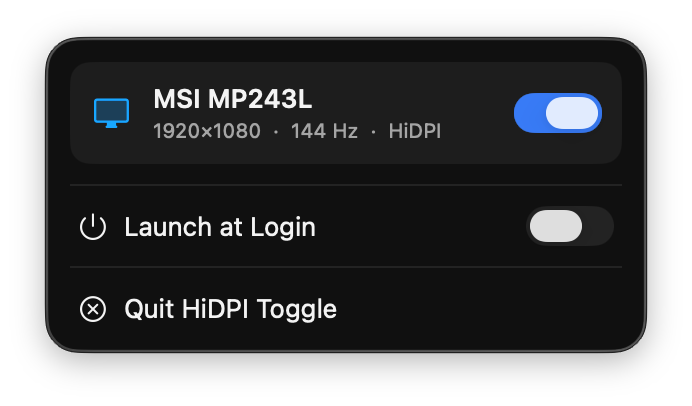
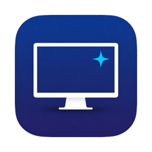

# HiDPI-Toggle

<p align="center">
  
  &nbsp;
  
  &nbsp;
  
  &nbsp;
  
</p>

<p align="center">
  <a href="https://github.com/nipunyatawara-dev/HiDPI-Toggle/releases/latest/download/HiDPIToggle-v1.0.dmg">
    
  </a>
</p>


[**HiDPI Toggle**](https://github.com/nipunyatawara-dev/HiDPI-Toggle) is a tiny macOS menu bar app that replicates BetterDisplay's HiDPI feature: it lists connected external monitors and gives each one a switch to turn HiDPI (Retina scaling) on or off.

* One-click HiDPI toggle per external display from the menu bar
* Instant mode switch — no virtual displays, mirroring, or black screens
* Shows resolution, refresh rate, and current HiDPI state for each monitor
* Auto-refreshes when displays are connected or disconnected
* Launch at Login via `SMAppService` (visible in System Settings → Login Items)
* Built with SwiftPM — no Xcode project required

# Contents <!-- omit in toc -->

- [What HiDPI Toggle is and isn't](#what-hidpi-toggle-is-and-isnt)
- [Menu bar panel](#menu-bar-panel)
- [How it works](#how-it-works)
- [Launch at login](#launch-at-login)
- [Download](#download)
- [Build & run](#build--run)
- [Tech stack](#tech-stack)
- [Limitations](#limitations)
- [Contributing](#contributing)

<a name="about"></a>

# What HiDPI Toggle is and isn't

* **HiDPI Toggle is** a free, open-source utility for anyone who wants sharper text and UI on an external monitor without paying for BetterDisplay — it unlocks the hidden Retina scaling modes macOS already knows about but does not expose in System Settings

* **HiDPI Toggle is not** a full BetterDisplay replacement. It does not manage brightness, color profiles, virtual screens, DDC/CI, or display arrangements — only HiDPI scaling on external displays

<a name="panel"></a>

# Menu bar panel



Click the sparkle-TV icon in the menu bar to open the panel.

* Each connected **external** monitor appears as a card with its name, resolution, and refresh rate
* Flip the switch to enable or disable HiDPI for that display
* Displays without a HiDPI variant at the current resolution show **HiDPI unavailable** and the switch is disabled
* Errors (mode read failures, unsupported displays) appear inline in red
* **Launch at Login** keeps the app running after reboot
* **Quit HiDPI Toggle** exits the app — your current HiDPI setting stays in place for the session

The app lives in the menu bar only (`LSUIElement`); there is no Dock icon.

<a name="how"></a>

# How it works

macOS hides the HiDPI ("Retina") variants of an external monitor's resolutions from the public API and the Displays settings panel, but WindowServer keeps them in its internal mode list.

HiDPI Toggle uses the same private CGS calls as BetterDisplay:

* `CGSGetDisplayModeDescriptionOfLength` — reads the full mode list
* `CGSConfigureDisplayMode` — switches to the hidden "same resolution, density 2.0" mode in place

The GPU then renders at 2× and downscales, so text and UI look much sharper at the same logical resolution. Turning the switch off selects the density 1.0 mode again.

The `probe/` folder contains the small research tools used to discover these hidden modes:

* `probe.m` — dumps the WindowServer mode list for a display
* `toggle_test.m` — switches modes from the command line
* `icon_gen.swift` — generates `Icon.icns` from `icon-src.png`

<a name="login"></a>

# Launch at login

The panel includes a **Launch at Login** switch backed by `SMAppService`. Enabling it registers the app as a login item (visible under **System Settings → General → Login Items**).

Registration points at the app's current location on disk. If you move `HiDPIToggle.app` to a new folder, open the panel and re-enable the switch from the new location.

<a name="download"></a>

# Download

Pre-built releases are available on the [Releases](https://github.com/nipunyatawara-dev/HiDPI-Toggle/releases) page.

1. Download `HiDPIToggle-v1.0.dmg`
2. Open the disk image and drag **HiDPI Toggle** to Applications
3. On first launch, macOS may block the app — open **System Settings → Privacy & Security** and click **Open Anyway**
4. Connect an external monitor, click the menu bar icon, and toggle HiDPI

**Requirements:** macOS 14 (Sonoma) or later · Apple Silicon (M1 or later)

<a name="build"></a>

# Build & run

### Prerequisites

* macOS 14 (Sonoma) or later
* Apple Silicon Mac (M1, M2, M3, M4, or later) — Intel Macs are not supported
* Xcode Command Line Tools (Swift 6)

```bash
xcode-select --install   # if you have not already
```

### Steps

1. Clone the repository:

   ```bash
   git clone https://github.com/nipunyatawara-dev/HiDPI-Toggle.git
   cd HiDPI-Toggle
   ```

2. Build a release `.app` bundle:

   ```bash
   APP_NAME=HiDPIToggle BUNDLE_ID=com.local.hidpitoggle MENU_BAR_APP=1 \
     Scripts/package_app.sh release
   ```

3. Open the app:

   ```bash
   open HiDPIToggle.app
   ```

   The sparkle-TV icon appears in the menu bar. Connect an external monitor, click the icon, and toggle HiDPI.

### Debug build (terminal only)

```bash
swift build
.build/debug/HiDPIToggle
```

### App icon

`Icon.icns` at the project root is bundled automatically by `Scripts/package_app.sh`. To regenerate it from the source artwork:

```bash
swift probe/icon_gen.swift
```

# Tech stack

| Layer | Technology |
| --- | --- |
| **Language** | Swift 6 |
| **UI** | SwiftUI (`MenuBarExtra`, `.menuBarExtraStyle(.window)`) |
| **Display APIs** | CoreGraphics + private CGS bindings (`CGSPrivate` target) |
| **Login item** | ServiceManagement (`SMAppService`) |
| **Packaging** | SwiftPM + `Scripts/package_app.sh` (no `.xcodeproj`) |
| **Minimum OS** | macOS 14.0 |

<a name="limitations"></a>

# Limitations

* **External displays only** — the built-in Mac display is filtered out
* **Private APIs** — CGS mode-switch functions are undocumented Apple APIs; this app is not App Store–eligible (same situation as BetterDisplay for this feature)
* **Session persistence** — HiDPI mode lasts for the current session; quitting the app does not revert it
* **Hardware dependent** — not every monitor/resolution combination has a hidden HiDPI variant; the app disables the switch when none exists
* **Ad-hoc signing** — the build script signs with an ad-hoc identity (`-`). For distribution outside your machine you may need to adjust signing or allow the app in **Privacy & Security**

<a name="contributing"></a>

# Contributing

Pull requests and issue reports are welcome.

1. Fork the repo and create a feature branch
2. Make your changes and verify the app still builds:

   ```bash
   APP_NAME=HiDPIToggle BUNDLE_ID=com.local.hidpitoggle MENU_BAR_APP=1 \
     Scripts/package_app.sh release
   ```

3. Open a pull request with a clear description of what changed and why

---

<p align="center">
  
</p>
